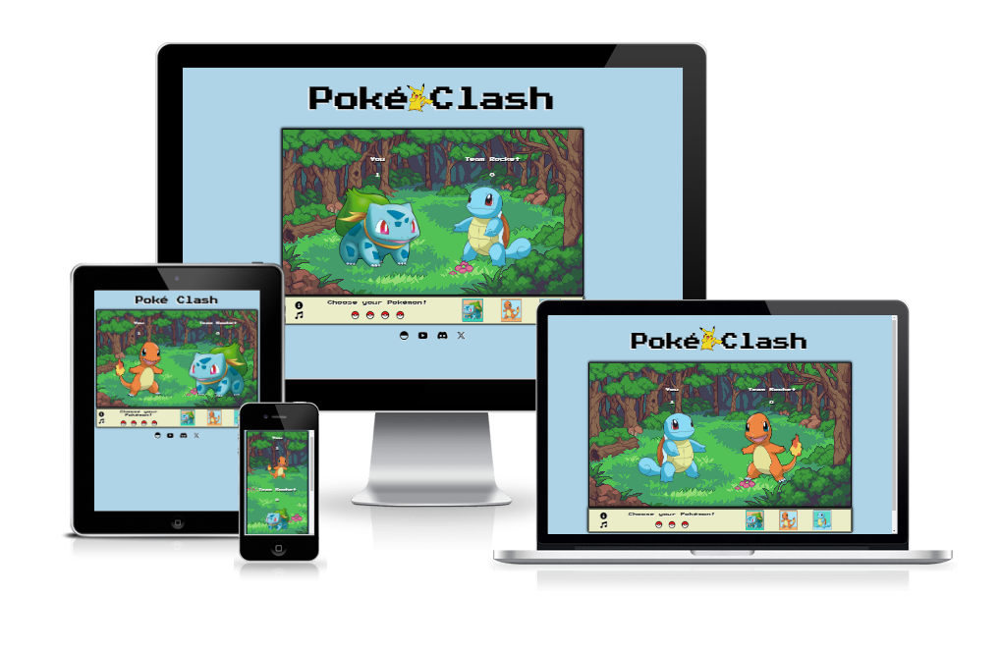
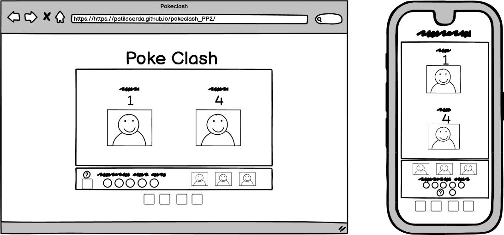
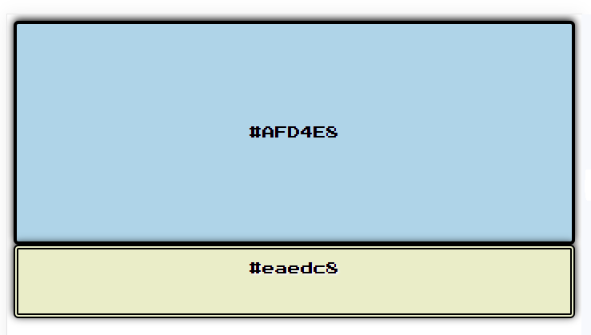
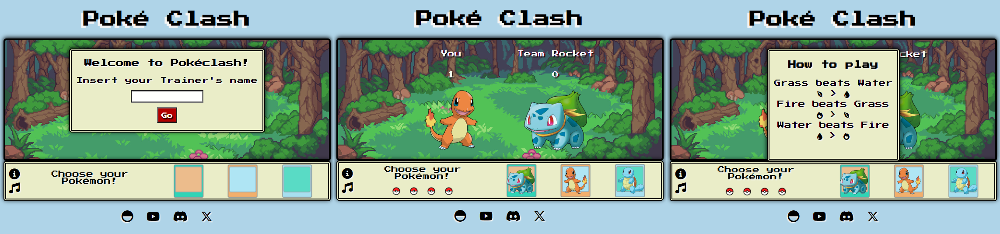
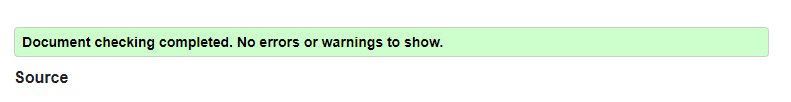
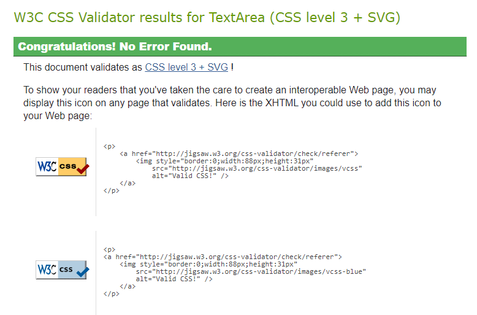
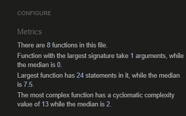
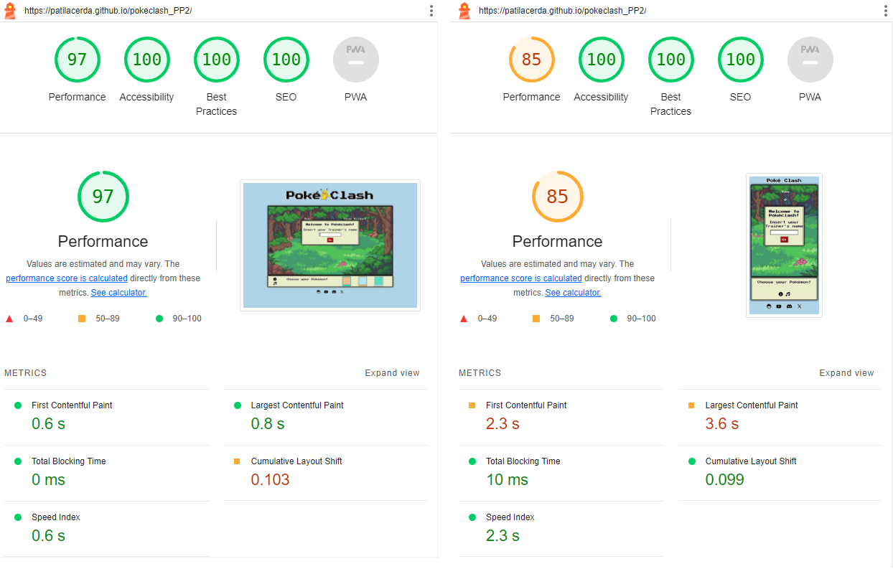

<h1 align="center"></h1>

Poké Clash is an exciting Pokemon card battle game inspired by the classic rock-paper-scissors game where you can challenge the computer to a game of strategy.<a href="https://patilacerda.github.io/pokeclash_PP2/" target="_blank"> View the deployed project here.</a>

<h2>Features</h2>
<h3>How to play</h3>

You have the option to personalize your game experience by entering your name. When the game starts, you can insert your own name to appear on the arena screen.

<ol>
<li>Start by selecting your Pokemon card.</li>
<li>The computer will also randomly select a Pokemon card.</li>
<li>Each Pokemon card has its type (e.g., Fire, Water, Grass).</li>
<li>The game follows the type advantage system:
<ul>
<li>Fire beats Grass</li>
<li>Grass beats Water</li>
<li>Water beats Fire</li>
</ul>
</li>
<li>Keep playing to see how many wins you can rack up against the computer!</li>
</ol>
<h3>Future Features</h3>

While the current version of Poké Clash is a simple one-card battle against the computer, we have exciting plans for the future, including:

<ul>
<li>Expanding the card collection with more Pokemon and abilities.</li>
<li>Implementing a ranking system for players to compete and climb the leaderboards.</li>
<li>Adding animations and visual effects for a more immersive experience.</li>
</ul>
<h2>User Experience</h2>
<h3>User stories</h3>
<ul>
<li>As a Pokemon fan, I want to enjoy a quick and fun card battle game against the computer.</li>
<li>As a gamer, I want a straightforward interface to engage with the game</li>
<li>As a competitive player, I want to challenge the computer and test my strategic skills.</li>
</ul>
<h3>Wireframes</h3>

Wireframes created using Balsamiq.

<h2>Design</h2>
<h3>Typography</h3>
<ul>
<li>Press Start 2P, cursive - The main font, it perfectly captures the essence of a classic console game.</li>
</ul>
<h3>Colour Scheme</h3>

The color scheme draws inspiration from Pokemon frames and previous games to create a nostalgic experience:

<ul>
<li>Black: Used for buttons, borders, and lettering, providing a sharp and contrasting element.</li>
<li>Control’s area background and additional tabs(#eaedc8): A soft, yellowish hue reminiscent of the classic Game Boy screen.</li>
<li>Background (#AFD4E8): A cool blue shade representing the world of Pokemon and adventure.</li>
</ul>
<h3>Layout</h3>

The site is a single page with 3 sections:

<ul>
<li>Main Frame: The central game area where battles take place.</li>
<li>Player Name Tab: A tab where you can insert your name, adding a personal touch to your gaming experience.</li>
<li>Rules Tab: A tab where you can view the game rules, ensuring you're always informed and ready for action.</li>
</ul>
<h2>Technologies Used</h2>
<h3>Languages</h3>
<ul>
<li><a href="https://en.wikipedia.org/wiki/HTML5" target="_blank">HTML5</a></li>
<li><a href="https://en.wikipedia.org/wiki/CSS" target="_blank">CSS3</a></li>
<li><a href="https://en.wikipedia.org/wiki/JavaScript" target="_blank">JavaScript</a></li>
</ul>
<h3>Frameworks, Libraries and Programs Used</h3>
<ul>
<li><a href="https://fonts.google.com/" target="_blank">Google Fonts</a> - Provide all of the fonts for this website.</li>
<li><a href="https://fontawesome.com/" target="_blank">Font Awesome</a> - Used for the site icons.</li>
<li><a href="https://favicon.io/" target="_blank">Favicon</a> - Used to generate favicon.</li>
<li><a href="https://www.adobe.com/ie/products/photoshop.html" target="_blank">Photoshop</a> - Used to compress images to reduce file size without a reduction in quality and create the cards background on controls area.</li>
<li><a href="https://git-scm.com/" target="_blank">Git</a> - Git was used for version control by utilizing the Gitpod terminal to commit to Git and Push to GitHub.</li>
<li><a href="https://github.com/patilacerda" target="_blank">Github</a> - Used to hosting the code.</li>
<li><a href="https://balsamiq.com/" target="_blank">Balsamiq</a> - Used to create site wireframes.</li>
<li><a href=”https://en.onlymp3.to/TCK/”>Only Mp3</a> - Used to convert the Youtube video to Mp3 audio.</li>
<li><a href="http://ami.responsivedesign.is/" target="_blank">Am I Responsive</a> - Used to check if the site is responsive on different screen sizes.</li>
<li><a href="http://www.responsinator.com/" target="_blank">Responsinator</a> - Used to check if the site is responsive on different screen sizes.</li>
<li><a href="https://developer.chrome.com/docs/devtools/" target="_blank">Chrome Dev Tools</a>- Used for overall development and tweaking, including testing responsiveness and performance.</li>
<li><a href="https://www.freeformatter.com" target="_blank">Free Online Formatter</a> - Used to correct indentation issues and get rid of unnecessary whitespace</li>
</ul>
<h2>Testing</h2>
<h3>Validating</h3>
<ul>
<li>HTML - No errors were returned when passing through the <a href="https://validator.w3.org/nu/" target="_blank">W3C Markup Validator</a>.</li>

<li>CSS - No errors were found when passing through the <a href="https://jigsaw.w3.org/css-validator/" target="_blank">W3C CSS Validator</a>.</li>

<li>JavaScript - No errors were found when passing through the <a href="https://jshint.com/" target="_blank">JSHint</a>.</li>

<li>Accessibility - Desktop 97% performance average and mobile 85% performance on lighthouse.</li>

</ul>
<h3>Further Testing</h3>

Chrome Developer Tools are used to test the responsiveness on: Desktop, Laptop, iPhone SE, iPhone XR, iPhone 12 Pro, iPad, iPad Pro, Galaxy Fold.

<h3>Known Bugs</h3>

Score Calculation Issue: In some instances, the game wasn't calculating the scores correctly. Players had to click 6 times instead of 5 to determine the winner. Additionally, sometimes the game incorrectly displayed a tie when one player should have won. This issue has been resolved by updating the statement that checks the round length. Instead of (rounds.length === 0), we now use (rounds.length - 1 === 0) to ensure accurate score calculation.

<h2>Deployment</h2>

The project was deployed using GitHub pages. The steps to deploy using GitHub pages are:

<ol>
<li>Go to the repository on GitHub.com.</li>
<li>Select 'Settings' near the top of the page.</li>
<li>Select 'Pages' from the menu bar on the left of the page.</li>
<li>Under 'Source' select the 'Branch' dropdown menu and select the main branch.</li>
<li>Once selected, click the 'Save'.</li>
<li>Deployment should be confirmed by a message on a green background saying "Your site is published at" followed by the web address.</li>
</ol>
<h3>Cloning</h3>

To clone the repository, follow these steps:

<ol>
<li>Locate the <a href=”https://patilacerda.github.io/pokeclash_PP2/” target=”_blank”>repository link</a> on GitHub.</li>
<li>Under the 'Code' button, you will see different cloning options, including HTTPS, SSH, and GitHub CLI. Click on your preferred cloning option.</li>
<li>Copy the URL provided.</li>
<li>Open your Terminal or Command Prompt.</li>
<li>In the Terminal, navigate to the directory where you want to create the local clone. You can use the cd command to change the current working directory.</li>
<li>Type the following command:
<li>git clone [paste the URL you copied from GitHub here]</li></li>
<li>Press 'Enter' to execute the command. This will create a local clone of the repository in the specified directory.</li>
</ol>
<h2>Credits</h2>
<h3>Content</h3>
<ul>
<li>The idea for this game was inspired by Code Institute Assessment Guide.</li>
<li>The code for this project was inspired by the work of <a href=”https://www.kennyyipcoding.com/” target=”_blank”>Kenny Yip</a>.</li>
</ul>
<h3>Media</h3>

Media used in this game, such as images and graphics, were sourced from the following links:

<ul>
<li>Squirtle, Pikachu and Bulbasaur - <a href=”https://www.stickpng.com/” target=”_blank”>Stick png</a></li>
<li>Charmander - <a href=”https://www.pngfind.com/” target=”_blank”> Png find</a></li>
<li>Arena background - <a href=”https://www.artstation.com/artwork/0PKZ8” target=”_blank”>Nauris Amatnieks Artstation page</a></li>
<li>Pokebola for rounds and favicon - <a href=”https://commons.wikimedia.org/” target=”_blank”>Wikimedia</a></li>
<li>Audio - <a href=”https://www.youtube.com/watch?v=1Pca2uJbYC4” target=”_blank”>Pokemon Theme 16-bit</a></li>
</ul>
<h3>Acknowledgments</h3>

I would like to express my gratitude to Nintendo for creating the magical world of the Pokemon game series, which has filled our childhoods with cherished memories.

A special thanks to my husband William Paiva for support and constant motivation throughout this project.

I am grateful to my mentor Antonio Rodriguez for providing valuable guidance and assistance during the final adjustments.

To all my friends who dedicated their time to test the game and join in the fun, your support and enthusiasm have been invaluable.

Your contributions, encouragement, and presence have made this project a reality, and I couldn't have done it without you. Thank you all!
